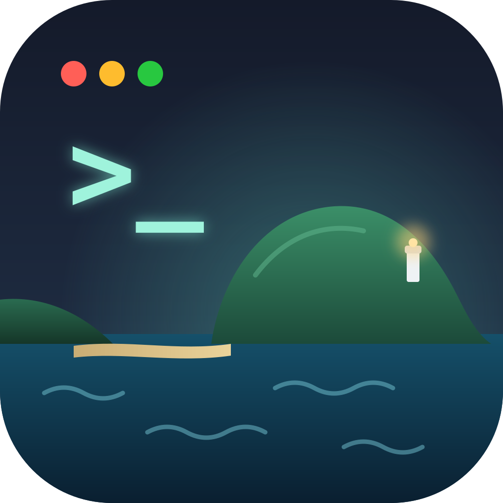
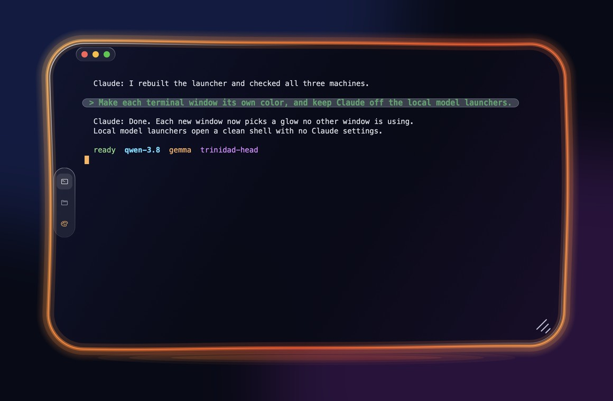
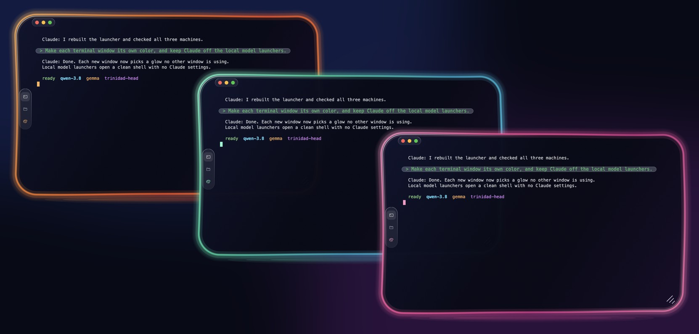
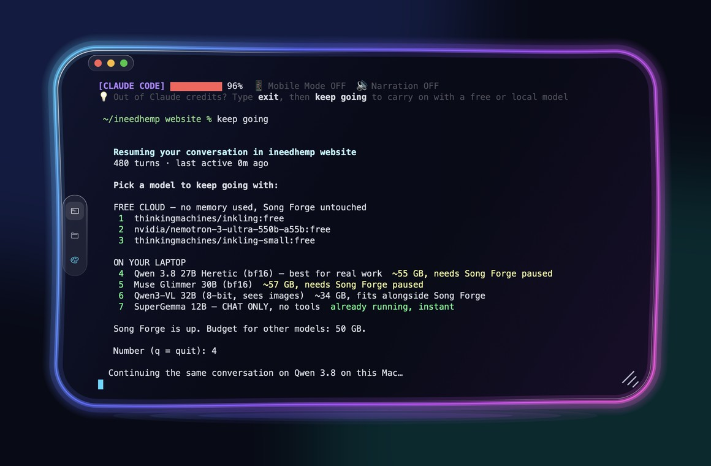

<div align="center">



# 🌊 Trinidad Head

### A terminal that looks as good as the work you do in it.

**Glass windows with a neon glow · a different color for every window · built from scratch for Windows and Mac**

**The terminal we recommend for running local AI models.**

[](#-get-it)
[](#-get-it)
[](https://www.rust-lang.org/)
[](#-whats-inside)

</div>



---

## 🌅 Why it exists

Most terminals are a plain black box. When you have three or four open, they all look the same, and
you lose track of which one is which. When you scroll back through a long chat with an AI helper,
your own questions get lost in the wall of text.

Trinidad Head fixes both, and makes the window something you actually enjoy looking at.

> **The name:** Trinidad Head is a headland on the Northern California coast, tied to the mainland
> by a strip of sand. This terminal is meant to tie things together the same way.

---

## 🌈 A color for every window

Open a few windows and each one glows a different color, picked automatically so no two match.
Want a different one? Click the paint palette on the side of the window.



---

## 🦙 Made for local models

If you run AI models on your own computer, this is the terminal for it:

- 🌈 **Tell your model windows apart.** Qwen in one color, Gemma in another, Claude in a third.
- 🔠 **Easy to read for long sessions**, with bigger text and your own prompts in their own bubble.
- 🧹 **Calm output** with Claude Code's focus view, and copy/paste that still works.
- 🔋 **Never stuck** when cloud credits run out (see below).

It pairs with **[Claude Code Local](https://github.com/nicedreamzapp/claude-code-local)**, which runs
Claude Code on your own Mac with no cloud at all.

---

## 🔋 Out of Claude credits? Keep going.

Every Claude window shows a small reminder at the bottom. When Claude runs out, type **exit**, then
**keep going**. You get a list of free cloud models and models that run right on your computer, and
the same conversation carries on with whichever you pick. Nothing is lost.



---

## ✨ What you get

- 🪟 **A window that feels designed.** Dark glass, softly rounded corners, a glowing rim, and the
  familiar red, yellow and green buttons. It looks the same on Windows and on a Mac.
- 💬 **Your questions stand out.** When you chat with Claude Code, what *you* typed sits in a soft
  rounded bubble with bigger green letters, so it's easy to find when you scroll back.
- 🔠 **Easy on the eyes.** Larger, clear text by default.
- 🧹 **A calm view for AI work.** It works with Claude Code's focus view, so you see your question,
  a short summary and the answer instead of a flood of technical lines.
- 🖱️ **Copy and paste just work.** Drag to select and it's copied. Right-click pastes. Hold Shift
  to select even inside full-screen apps.
- 🎙️ **Dictation friendly.** Voice typing and other input methods go straight in.
- ↘️ **Easy to resize.** Grab the little lines in the bottom corner, or any edge.

---

## 🧱 What's inside

Everything is written from scratch, with no borrowed terminal engine and no web browser hiding
inside:

| Piece | What it does |
|---|---|
| 🧠 **Engine** | Understands everything a shell prints: colors, cursor moves, full-screen apps |
| 🔌 **Shell host** | Runs PowerShell on Windows and your usual shell on the Mac |
| 🎨 **Window** | Draws the glass, the glow and the text using each system's own graphics |

The engine has no screen code of its own, so the same brain can later power a phone view, a web
view or an AI that reads the screen.

---

## 📦 Get it

There's no installer yet. Trinidad Head is young and changing fast. To build it yourself:

**Mac**

```bash
scripts/build-mac-app.sh              # puts "Trinidad Head" in ~/Applications
open -n -a "Trinidad Head"            # each launch opens its own window
```

**Windows** (no Visual Studio needed)

```powershell
rustup default stable-x86_64-pc-windows-gnullvm
# add llvm-mingw (github.com/mstorsjo/llvm-mingw) to PATH, then:
cargo build --release
target\release\trinidad-head.exe
```

---

## 🧭 Where it's going

- 🔄 **Sessions that survive.** Close the window and your work keeps running; reopen it anywhere.
- 🐧 **Windows and Linux side by side**, sharing files and copy/paste.
- 🤖 **AI helpers with guardrails.** Each gets its own tab, and risky commands wait for your OK.
- ♿ **Screen-reader support** from the start.

The full plan is in [docs/PLAN.md](docs/PLAN.md), and the research behind it is in
[docs/RESEARCH.md](docs/RESEARCH.md).

---

<div align="center">

Made in Humboldt County, California by **[Matt Macosko](https://nicedreamzwholesale.com/software/)** · [Project page](https://nicedreamzwholesale.com/software/trinidad-head/)

© 2026 Matt Macosko. All rights reserved for now; a license will be chosen before the first release.

</div>
