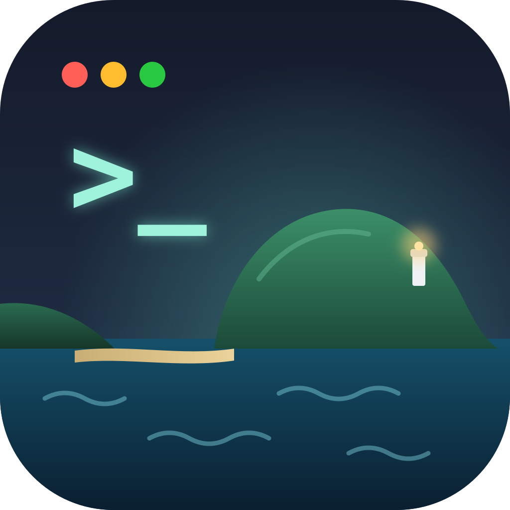
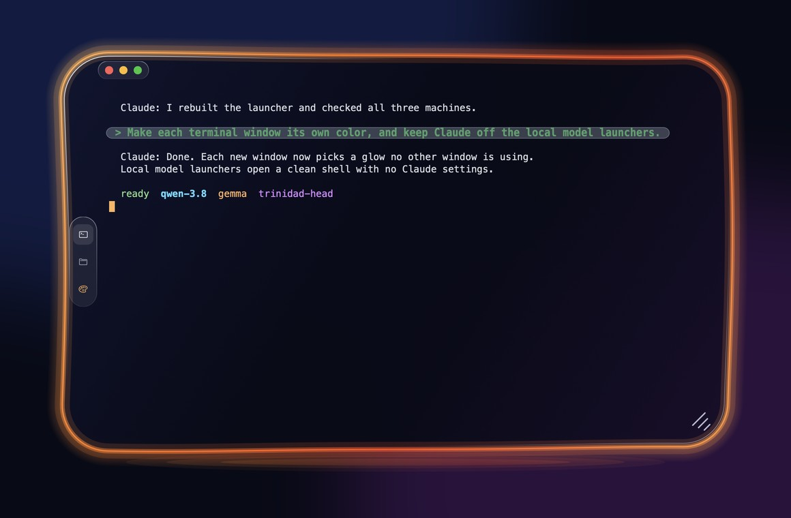
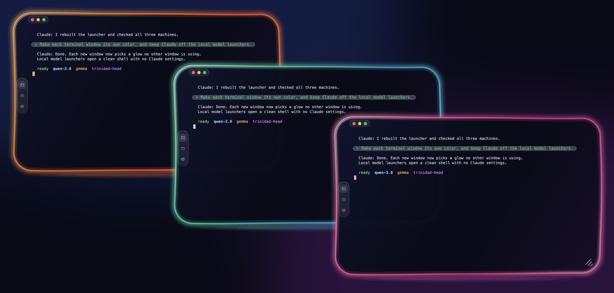

<div align="center">



# 🌊 Trinidad Head

### A terminal that looks as good as the work you do in it.

**Glass windows with a neon glow · a different color for every window · built from scratch for Windows and Mac**

**The terminal we recommend for running local AI models.**

[](#-get-it)
[](#-get-it)
[](https://www.rust-lang.org/)
[](#-whats-inside)

</div>

Trinidad Head is a terminal app for Windows and Mac, written from scratch in Rust, that gives
every window its own glowing color and makes your own prompts easy to find in long AI chat sessions.
Mac and Windows downloads are on the [latest release](#-get-it).



---

## 🌅 Why it exists

Most terminals are a plain black box. When you have three or four open, they all look the same, and
you lose track of which one is which. When you scroll back through a long chat with an AI helper,
your own questions get lost in the wall of text.

Trinidad Head fixes both, and makes the window something you actually enjoy looking at.

> **The name:** Trinidad Head is a headland on the Northern California coast, tied to the mainland
> by a strip of sand. This terminal is meant to tie things together the same way.

---

## 🌈 A color for every window

Open a few windows and each one glows a different color, picked automatically so no two match.
Want a different one? Click the paint palette on the side of the window.



---

## 🦙 Made for local models

If you run AI models on your own computer, this is the terminal for it:

- 🌈 **Tell your model windows apart.** Qwen in one color, Gemma in another, Claude in a third.
- 🔠 **Easy to read for long sessions**, with bigger text and your own prompts in their own bubble.
- 🧹 **Calm output** with Claude Code's focus view, and copy/paste that still works.

It pairs with **[Claude Code Local](https://github.com/nicedreamzapp/claude-code-local)**, which runs
Claude Code on your own Mac with no cloud at all.

---

## ✨ What you get

- 🪟 **A window that feels designed.** Dark glass, softly rounded corners, a glowing rim, and the
  familiar red, yellow and green buttons. It looks the same on Windows and on a Mac.
- 💬 **Your questions stand out.** When you chat with Claude Code, what *you* typed sits in a soft
  rounded bubble with bigger green letters, so it's easy to find when you scroll back.
- 🔠 **Easy on the eyes.** Larger, clear text by default.
- 🧹 **A calm view for AI work.** It works with Claude Code's focus view, so you see your question,
  a short summary and the answer instead of a flood of technical lines.
- 🖱️ **Copy and paste just work.** Drag to select, then Cmd+C (Ctrl+C on Windows) or right-click
  for Copy, Paste and Select All. Selecting works even inside full-screen apps like Claude Code.
- ⌫ **Edit what you typed like a text box.** Highlight words in Claude Code's prompt and press
  Backspace to delete them, or just type or paste over them. Normally a terminal can't, because the
  prompt belongs to Claude, not the terminal. Trinidad Head moves Claude's cursor for you and
  deletes exactly what you highlighted, even across wrapped lines.
- 📜 **Grab a paragraph bigger than the window.** Keep dragging past the top or bottom edge and
  the text keeps scrolling by itself, so you can take the whole thing without resizing anything.
- 🎙️ **Dictation friendly.** Voice typing and other input methods go straight in.
- ↘️ **Easy to resize.** Grab the little lines in the bottom corner, or any edge.

---

## 🧱 What's inside

Everything is written from scratch, with no borrowed terminal engine and no web browser hiding
inside:

| Piece | What it does |
|---|---|
| 🧠 **Engine** | Understands everything a shell prints: colors, cursor moves, full-screen apps |
| 🔌 **Shell host** | Runs PowerShell on Windows and your usual shell on the Mac |
| 🎨 **Window** | Draws the glass, the glow and the text using each system's own graphics |

The engine has no screen code of its own, so the same brain can later power a phone view, a web
view or an AI that reads the screen.

---

## 🛠️ What I built

Everything in this repo was built by **Matt Macosko**:

- **Terminal engine** ([crates/core-vt/src/lib.rs](crates/core-vt/src/lib.rs)): parses shell
  output, keeps the screen, scrollback and the alternate screen. No UI and no OS code.
- **Shell host** ([crates/pty](crates/pty/src)): Windows ConPTY ([conpty.rs](crates/pty/src/conpty.rs))
  and a Unix pty for the Mac ([unixpty.rs](crates/pty/src/unixpty.rs)).
- **Windows window** ([crates/app/src/win.rs](crates/app/src/win.rs)): Direct2D and DirectWrite
  drawing, selection, copy/paste, drag autoscroll and resizing.
- **Mac window** ([crates/app/src/mac](crates/app/src/mac)): AppKit view with dictation and input
  method support ([view.rs](crates/app/src/mac/view.rs)) and one shared Dock icon
  ([dock.rs](crates/app/src/mac/dock.rs)).
- **Window colors and prompt bubble** ([crates/app/src/theme.rs](crates/app/src/theme.rs)): eight
  glow colors, picked so open windows don't repeat.
- **Editing Claude Code's prompt like a text box** ([crates/app/src/prompt_edit.rs](crates/app/src/prompt_edit.rs)).
- **Typing-delay meter** ([crates/app/src/latency.rs](crates/app/src/latency.rs)) and a
  **self-updater** that rebuilds from git when the repo is on the machine ([crates/app/src/update.rs](crates/app/src/update.rs)).
- **Self-tests that drive the real app** ([crates/app/src/mac/selftest.rs](crates/app/src/mac/selftest.rs),
  [scripts/mac-selftest.sh](scripts/mac-selftest.sh), [pc-tools/th_selftest.ps1](pc-tools/th_selftest.ps1))
  and the release packaging ([scripts/package-release.sh](scripts/package-release.sh),
  [pc-tools/package-release.ps1](pc-tools/package-release.ps1)).

Upstream: Rust, Microsoft's [`windows`](https://crates.io/crates/windows) crate, the
[`objc2`](https://crates.io/crates/objc2) crates for AppKit, and
[`unicode-width`](https://crates.io/crates/unicode-width). Claude Code is Anthropic's tool; Trinidad
Head only hosts it.

---

## 📦 Get it

**[⬇️ Download for Mac](https://github.com/nicedreamzapp/trinidad-head/releases/latest/download/Trinidad-Head-mac.zip)**
(Apple Silicon and Intel, macOS 14+) &nbsp;·&nbsp;
**[⬇️ Download for Windows](https://github.com/nicedreamzapp/trinidad-head/releases/latest/download/Trinidad-Head-windows.zip)**
(Windows 10 and 11)

- **Mac:** unzip, drag Trinidad Head into Applications and open it. It's signed and notarized by
  Apple, so there's no warning.
- **Windows:** unzip and double-click Trinidad Head.exe. If a blue "protected your PC" box shows,
  click **More info**, then **Run anyway**.

Or build it yourself:

**Mac**

```bash
scripts/build-mac-app.sh              # puts "Trinidad Head" in ~/Applications
open -n -a "Trinidad Head"            # each launch opens its own window
```

The build signs with an Apple Development certificate if your Mac has one. Without one, run
`TH_ALLOW_ADHOC=1 scripts/build-mac-app.sh` (macOS then forgets permissions you granted the app on
each rebuild).

**Windows** (no Visual Studio needed)

```powershell
rustup default stable-x86_64-pc-windows-gnullvm
# add llvm-mingw (github.com/mstorsjo/llvm-mingw) to PATH, then:
cargo build --release
target\release\trinidad-head.exe
```

It starts PowerShell 7 if installed, otherwise Windows PowerShell.

### 🚧 Not there yet

- **No Linux window.** On Linux the app only prints "there is no window for this OS yet".
- **One shell per window.** No tabs or splits.
- **The Windows download is not code-signed**, so SmartScreen warns on first launch (see above).

---

## 📜 License

Trinidad Head is dual-licensed under either the [MIT License](LICENSE-MIT) or the
[Apache License 2.0](LICENSE-APACHE), at your option, the same way most Rust projects are.
Unless you say otherwise, any contribution you submit is dual-licensed the same way.

---

<div align="center">

Made in Humboldt County, California by **[Matt Macosko](https://nicedreamzwholesale.com/software/)** · [Project page](https://nicedreamzwholesale.com/software/trinidad-head/)

© 2026 Matt Macosko. Licensed under MIT or Apache-2.0, your choice.

</div>
